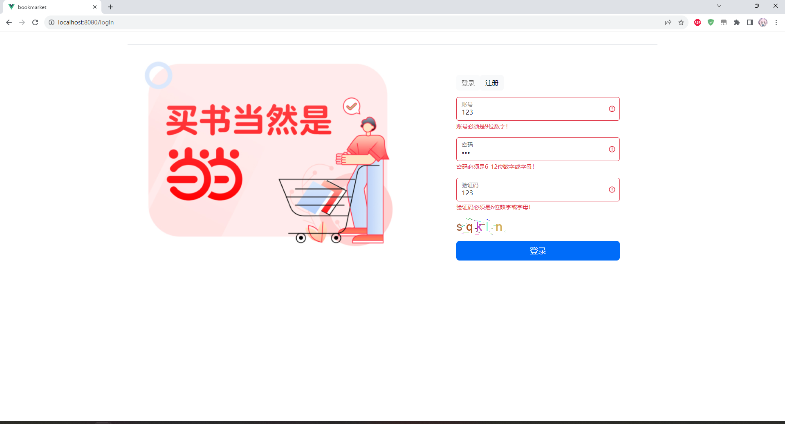

# 网上书店（BookMark）

## 项目说明

这是一个Java项目，采用前后端分离，实现网上书店的基本功能，比如：

* 用户登录注册
* 图书商品的查询和浏览
* 购物车系统
* 订单系统（可退货可取消）
* 用户基本信息管理
* ...

Vue项目说明：[BookMarket-ForVue](https://github.com/MnTeriri/BookMarket-ForVue)  
后台管理系统项目说明：[BookMarket-ForCpp](https://github.com/MnTeriri/BookMarket-ForCpp)

## 使用的框架

* SpringBoot
* Spring Security
* Spring Quartz
* Spring Redis
* Mybatis
* Mybatis-Plus
* Vue3
* ...

## 界面效果
* 这里放几个典型界面供参考

### 登录/注册界面

登录界面

注册界面

登录界面（输入数据不合法）

登录界面（登录成功）

### 主页

主界面

书籍页面（上）

书籍页面（下）

### 购物车

购物车

购物车（点击结算后）

### 个人中心

个人中心

个人中心（订单信息 上）

个人中心（订单信息 下）

## 数据库设计
* 该项目数据库结构为本人自主设计，采用MySQL数据库，设计过程严格按照数据库设计规范，E-R图如下：

* 建立数据库代码如下（部分）：
~~~mysql
CREATE TABLE User(
    id INT PRIMARY KEY AUTO_INCREMENT,
    uid CHAR(9)     NOT NULL,#用户编号
    uname VARCHAR(50) NOT NULL,
    password CHAR(32) DEFAULT 'e10adc3949ba59abbe56e057f20f883e',#默认密码123456（MD5加密）
    flag TINYINT NOT NULL DEFAULT 1,# 0为商家账号，1为客户账号
    status INT NOT NULL DEFAULT 1,# 0为假删除
    image    MEDIUMBLOB,#用户头像
    constraint user_uid_uindex unique (uid)#设置uid的唯一索引
);

CREATE TABLE Address(
    id INT PRIMARY KEY AUTO_INCREMENT,#地址编号
    uid CHAR(9) NOT NULL,#用户编号
    province VARCHAR(20) NOT NULL,#省
    city VARCHAR(20) NOT NULL,#市
    district VARCHAR(20) NOT NULL,#区
    address VARCHAR(100) NOT NULL,#详细地址
    receiver_name VARCHAR(20) NOT NULL,#收件人
    phone CHAR(11) NOT NULL,#电话号码
    is_default INT NOT NULL DEFAULT 0,#默认不选中 1为选中
    status int  NOT NULL DEFAULT 1,# 0为假删除
    CONSTRAINT fk_address_user_uid FOREIGN KEY (uid) REFERENCES User (uid)#地址表uid字段参照user表uid字段
);

CREATE TABLE Book(
    id INT PRIMARY KEY AUTO_INCREMENT,
    bid CHAR(13) NOT NULL,#图书编号
    cid INT NOT NULL,#图书分类，参考Category的主键
    bname VARCHAR(255) NOT NULL,#图书名称
    author VARCHAR(255) NOT NULL,#作者名称
    publisher VARCHAR(255) NOT NULL,#出版社名称
    publish_time DATETIME NOT NULL DEFAULT CURRENT_TIMESTAMP,#出版时间
    image MEDIUMBLOB,#书籍图片
    price  DECIMAL(13, 3) NOT NULL DEFAULT 0,#价格
    discount DECIMAL(3, 2)  NOT NULL DEFAULT 1,#折扣
    count INT NOT NULL DEFAULT 0,#数量
    description TEXT,#图书描述
    status INT NOT NULL DEFAULT 0,#图书状态 0正常、1缺货、2下架
    CONSTRAINT fk_book_category_cid FOREIGN KEY (cid) REFERENCES Category (id),# book表cid参照category表id字段
    CONSTRAINT book_bid_uindex UNIQUE (bid)# bid设置唯一索引
);

CREATE TABLE `Order`(
    id INT PRIMARY KEY AUTO_INCREMENT,
    oid CHAR(20) NOT NULL,#订单编号
    uid CHAR(9) NOT NULL,#用户编号
    aid int NOT NULL,#地址编号
    price DECIMAL(13, 3) NOT NULL DEFAULT 0,#总金额
    status INT NOT NULL DEFAULT 0,#订单状态 0待付款、1已付款、2已发货、3交易成功、4交易取消、5退货、6退货成功
    created_time DATETIME NOT NULL DEFAULT CURRENT_TIMESTAMP,#创建时间
    pay_time DATETIME,#付款时间
    send_time DATETIME,#发货时间
    finish_time DATETIME,#完成时间
    CONSTRAINT fk_order_user_uid FOREIGN KEY (uid) REFERENCES User (uid), # order表uid参照user表uid字段
    CONSTRAINT fk_order_address_id FOREIGN KEY (aid) REFERENCES Address (id), # order表aid参照address表id字段
    CONSTRAINT order_oid_uindex UNIQUE (oid) # oid设置唯一索引
);
# ...
~~~
* 存储过程代码如下（以创建订单为例）：
~~~mysql
CREATE PROCEDURE create_order(IN v_oid CHAR(20), IN v_uid CHAR(9), IN v_aid INT, OUT v_result INT)
BEGIN
    DECLARE done INT DEFAULT 0;
    DECLARE result INT DEFAULT 1; # 1成功、-4SQL语句出错、-3购物车为空、-2书籍缺货或者下架、-1书籍数量不够
    DECLARE total_price DECIMAL(13, 3) DEFAULT 0;
    DECLARE c_bid CHAR(13);#购物车bid
    DECLARE c_count INT DEFAULT 0;#购物车书籍数量
    DECLARE b_count INT DEFAULT 0;#书籍数量
    DECLARE b_price DECIMAL(13, 3);#书籍价格
    DECLARE b_discount DECIMAL(3, 2);#书籍折扣
    DECLARE b_status INT DEFAULT 0;#书籍状态
    DECLARE total_count INT DEFAULT 0;#购物车已选中书籍个数
    DECLARE cursor_cart CURSOR FOR SELECT bid, count FROM Cart WHERE uid = v_uid AND selected = 1;
    DECLARE CONTINUE HANDLER FOR NOT FOUND SET done = 1;
    DECLARE CONTINUE HANDLER FOR SQLWARNING, SQLEXCEPTION SET result = -4; # SQL语句出错，退出并回滚

    SELECT COUNT(1) INTO total_count FROM Cart WHERE uid = v_uid AND selected = 1;#查询购物车选中商品个数

    IF total_count != 0 THEN
        START TRANSACTION;
        OPEN cursor_cart;
        label:REPEAT
            FETCH cursor_cart INTO c_bid,c_count;
            IF NOT done THEN
                SELECT count, price, discount, status INTO b_count,b_price,b_discount,b_status FROM Book WHERE bid = c_bid;
                IF b_status != 0 THEN
                    SET result = -2;#书籍处于缺货或者下架，退出循环并回滚
                    LEAVE label;
                END IF;
                IF b_count >= c_count THEN
                    SELECT * FROM Book WHERE bid = c_bid FOR UPDATE;#给Book表加行级锁
                    IF b_count = c_count THEN#更新书籍数量
                        UPDATE Book SET count=0, status=1 WHERE bid = c_bid;#数量正好够，修改书籍数量、状态
                    ELSE
                        UPDATE Book SET count=count - c_count WHERE bid = c_bid;#数量够，修改书籍数量
                    END IF;
                    INSERT INTO Storage(bid, uid, amount, status) VALUES (c_bid, v_uid, c_count, 1);#添加书籍存储信息
                    INSERT INTO Order_Book(oid, bid, count, price, discount)
                    VALUES (v_oid, c_bid, c_count, b_price, b_discount);#添加订单书籍表数据
                    DELETE FROM Cart WHERE uid = v_uid AND bid = c_bid;#删除对应购物车数据
                    SET total_price = total_price + c_count * b_price * b_discount;#计算订单总价格
                ELSE
                    SET result = -1;#书的数量不够，退出循环并回滚
                    LEAVE label;
                END IF;
            END IF;
        UNTIL done
            END REPEAT label;
        CLOSE cursor_cart;
    ELSE
        SET result=-3;
    END IF;

    IF result = 1 THEN
        INSERT INTO `Order`(oid, uid, aid, price) VALUES (v_oid, v_uid, v_aid, total_price);
        COMMIT;
    ELSE
        ROLLBACK;#如果result!=1，创建订单失败，回滚
    END IF;
    SET v_result = result;
END;
~~~

## 项目进展

### 2023/7/21

* 上传到了GitHub
* 截止到7月21号，实现了如下功能：
* 1. 登录和注册请求的处理
* 2. 商品页面的分页、查询的处理
* 3. 实体类的建立
* 4. 基本DAO的建立

### 2023/7/22

实现了如下功能：

* 编写了OrderController的orderList()，处理前端查询请求（订单号、分页数据还未处理）
* 编写了OrderService的getOrderList()，处理查询订单信息的请求（目前只能处理查询所有订单，分页和订单号还是给死）
* 对订单实体类（Order）进行了修改，之前在@TableName()注解的表名有误，导致QueryWrapper执行出问题（保留字需加上``）
* 对订单查询类型起了名（”all“：所有订单，”notPay“：待支付，”notReceive“：待收货，”finish“：已完成，”cancel“：已取消）

### 2023/7/31

* OrderService的getOrderList()所有功能全部完成（订单号搜索、订单类型搜索、分页）
* 给OrderService添加了getRecordsByOidAndUidAndStatus()，用于计算经过筛选后的订单数量，以全部完成
* OrderController的orderList()所有功能全部完成，并在这里计算页数返回到前端

### 2023/8/1

* 看了一下定时任务的实现，有两种，一种是SpringBoot的ThreadPoolTaskScheduler，另一种是Quartz。
  在这里我选择了Quartz，由于我想实现当订单付款时取消订单任务，
  如果使用ThreadPoolTaskScheduler， 需要一个Map来存放对应订单id和ScheduledFuture对象，当订单量超过一定数量，这个Map必爆炸
  所以采用Quartz，因为Quartz定时器在创建时有一个Trigger，当用户在15分钟内付款，我可以根据TriggerKey来关闭对应的定时器，这样效率会高很多

### 2023/8/2

* 相关类的介绍：
* 1. SchedulerFactoryBean是Spring Framework中提供的一个用于配置和创建Quartz Scheduler的工厂类。它允许将 Quartz Scheduler集成到Spring应用程序中，并通过 Spring 的依赖注入来管理Quartz的配置和调度任务
* 2. JobDetail是Quartz框架中的一个类，用于定义和描述一个具体的Job（任务）实例。它包含了执行Job的相关信息，比如Job的类名、Job的名称、Job的组名、Job执行时所需的数据等
* 3. Trigger是用于触发Job（任务）执行的对象，它定义了Job 的执行时间和调度规则。Trigger控制着Job在何时执行以及如何重复执行

* 创建了QuartzConfig类，用于配置Quartz，其中有一个schedulerFactoryBean()方法，返回一个SchedulerFactoryBean，给相应的Service层调用
* 创建了OrderJob类，用于实现定时器到时间后所执行的任务，需继承Job接口，实现execute方法。该方法有一个参数，为JobExecutionContext对象，该对象能获取创建定时任务时的JobDetail对象和Trigger对象，继而获取在JobDetail对象添加的数据。
* 代码如下：

~~~Java
@Configuration
public class QuartzConfig {
    @Bean
    public SchedulerFactoryBean schedulerFactoryBean() {
        SchedulerFactoryBean schedulerFactoryBean = new SchedulerFactoryBean();
        // 设置触发器是否覆盖已存在的任务
        schedulerFactoryBean.setOverwriteExistingJobs(true);
        // 设置调度器是否自动启动
        schedulerFactoryBean.setAutoStartup(true);
        // 设置调度器的名称为OrderScheduler
        schedulerFactoryBean.setSchedulerName("OrderScheduler");
        // 设置调度器的启动延迟为 1 秒
        schedulerFactoryBean.setStartupDelay(1);
        // 设置调度器的应用程序上下文调度器上下文键为 "applicationContext"
        schedulerFactoryBean.setApplicationContextSchedulerContextKey("applicationContext");
        return schedulerFactoryBean;
    }

}

@Component
public class OrderJob implements Job {
    @Override
    public void execute(JobExecutionContext jobExecutionContext) throws JobExecutionException {
        //对应的定时任务处理模块
    }
}
~~~

* 在OrderService创建了createOrder()，用于创建订单。首先生成20位订单号（当前时间日期+6位随机数），然后查询该订单号是否存在，如果存在则重新生成。
  然后调用OrderDao的createOrder()创建订单（还未实现），当创建成功后，给订单添加定时任务。
  添加定时任务中使用了JobBuilder类、TriggerBuilder类创建JobDetail对象和Trigger对象 并使用withIdentity()
  方法设置JobDetail对象和Trigger对象的名称和组名，
  使用usingJobData()给JobDetail对象添加数据，最后调用SchedulerFactoryBean对象的getScheduler()获取Scheduler对象，
  使用Scheduler的scheduleJob()添加定时任务
* 代码如下：
~~~Java
@Service
public class OrderServiceImpl implements IOrderService {
    @Autowired
    private IOrderDao orderDao;
    @Autowired
    private SchedulerFactoryBean schedulerFactoryBean;
    
    @Override
    public Integer createOrder(Order order) {
        //订单创建处理...
        if (result == 1) {//如果订单创建成功
            // 设置订单定时任务，在15分钟后检查订单状态
            JobDetail jobDetail = JobBuilder.newJob(OrderJob.class)
                    .withIdentity(order.getOid(), "orderGroup")
                    .usingJobData("orderOid", order.getOid())
                    .build();
            LocalDateTime localDateTime = LocalDateTime.now().plusSeconds(10);
            Trigger trigger = TriggerBuilder.newTrigger()
                    .withIdentity(order.getOid(), "orderGroup")
                    .startAt(Date.from(localDateTime.atZone(ZoneId.systemDefault()).toInstant()))
                    .build();
            try {
                Scheduler scheduler = schedulerFactoryBean.getScheduler();
                scheduler.scheduleJob(jobDetail, trigger);//添加订单定时任务
            } catch (SchedulerException e) {
                throw new RuntimeException(e);
            }
        }
        return result;
    }
}
~~~

* 在OrderService创建了cancelOrder()，用于取消订单。首先调用SchedulerFactoryBean对象的getScheduler()获取Scheduler对象，
  使用Scheduler的unscheduleJob()删除需要取消订单的定时任务，取消定时任务后调用OrderDao的cancelOrder()取消订单（还未实现）
* 在OrderService创建了searchOrder()，使用订单号搜索订单。使用了QueryWrapper
* 代码如下：
~~~Java
@Service
public class OrderServiceImpl implements IOrderService {
    @Autowired
    private IOrderDao orderDao;
    @Autowired
    private SchedulerFactoryBean schedulerFactoryBean;

    @Override
    public Integer cancelOrder(Order order) {
        try {//删除对应订单的定时任务
            Scheduler scheduler = schedulerFactoryBean.getScheduler();
            scheduler.unscheduleJob(new TriggerKey(order.getOid(), "orderGroup"));
        } catch (SchedulerException e) {
            throw new RuntimeException(e);
        }
        //订单取消处理...
        return (Integer) data.get("result");
    }
}
~~~

* 实现了OrderJob类的execute()，使用JobExecutionContext对象的getJobDetail()获取JobDetail对象，再使用getJobDataMap()
  获取JobDataMap对象
  该对象就是创建定时任务时为JobDetail对象添加的数据，在这里我给他添加了订单号，获取后调用OrderService对象的searchOrder()
  搜索最新的订单状态，
  当订单还未付款，则调用OrderDao的cancelOrder()取消订单（还未实现），并打印相应消息

### 2023/8/3

* 添加了AddressService，用于实现地址信息的操作，目前实现了searchDefaultAddress()，用于搜索用户的默认地址
* 实现了购物车全选功能，给CartController、CartService、CartDAO添加了selectAllCart()
  方法（由于UpdateWrapper没法连接查询，这里用@Update()注解编写自定义sql）
* CartController的getCartList()进行功能添加，现在把用户默认地址信息进行查询并返回给表示层

### 2023/8/12

* 上述未实现功能全部实现。需要注意的是，在OrderJob类当中如需使用@Autowired，需进行如下配置：
* 其实就是让SpringBoot掌管OrderJob对象的创建
~~~Java
@Component
public class SpringContextUtils implements ApplicationContextAware {
    public static ApplicationContext applicationContext;

    @Override
    public void setApplicationContext(ApplicationContext applicationContext) throws BeansException {
        SpringContextUtils.applicationContext = applicationContext;
    }
}

public final class AutowiringSpringBeanJobFactory extends SpringBeanJobFactory implements ApplicationContextAware {
    private transient AutowireCapableBeanFactory beanFactory;

    @Override
    public void setApplicationContext(final ApplicationContext context) {
        beanFactory = context.getAutowireCapableBeanFactory();
    }

    @Override
    protected Object createJobInstance(final TriggerFiredBundle bundle) throws Exception {
        final Object job = super.createJobInstance(bundle);
        beanFactory.autowireBean(job);
        return job;
    }
}

@Configuration
public class QuartzConfig {
    @Bean
    public SchedulerFactoryBean schedulerFactoryBean() {
        SchedulerFactoryBean schedulerFactoryBean = new SchedulerFactoryBean();
        // 设置触发器是否覆盖已存在的任务
        schedulerFactoryBean.setOverwriteExistingJobs(true);
        // 设置调度器是否自动启动
        schedulerFactoryBean.setAutoStartup(true);
        // 设置调度器的名称为OrderScheduler
        schedulerFactoryBean.setSchedulerName("OrderScheduler");
        // 设置调度器的启动延迟为 1 秒
        schedulerFactoryBean.setStartupDelay(1);
        // 设置调度器的应用程序上下文调度器上下文键为 "applicationContext"
        schedulerFactoryBean.setApplicationContextSchedulerContextKey("applicationContext");

        AutowiringSpringBeanJobFactory jobFactory = new AutowiringSpringBeanJobFactory();
        jobFactory.setApplicationContext(SpringContextUtils.applicationContext);
        schedulerFactoryBean.setJobFactory(jobFactory);

        return schedulerFactoryBean;
    }
}
~~~
* 更改了getListOrder()的查询方法，现在使用的是Mybatis的分步查询，代码如下：
~~~Java
@Repository
public interface IOrderDao extends BaseMapper<Order> {
    @SelectProvider(type = OrderSqlProvider.class, method = "getOrderListSql")
    @Results({
            @Result(property = "oid", column = "oid", javaType = String.class, jdbcType = JdbcType.VARCHAR),
            @Result(property = "aid", column = "aid", javaType = Integer.class, jdbcType = JdbcType.INTEGER),
            @Result(property = "address", column = "aid", one = @One(select = "com.example.bookmarket.dao.IAddressDao.searchById")),
            @Result(property = "books", column = "oid", many = @Many(select = "com.example.bookmarket.dao.IOrderBookDao.getOrderDetail"))
    })
    public List<Order> getOrderList(@Param("oid") String oid,
                                    @Param("uid") String uid,
                                    @Param("orderFilter") String orderFilter,
                                    @Param("page") Integer page,
                                    @Param("count") Integer count);
}

//用于组装复杂sql
public class OrderSqlProvider {
    public String getOrderListSql(@Param("oid") String oid,
                                  @Param("uid") String uid,
                                  @Param("orderFilter") String orderFilter,
                                  @Param("page") Integer page,
                                  @Param("count") Integer count) {
        String sql = "SELECT * FROM `Order` WHERE oid LIKE CONCAT('%', #{oid}, '%') AND uid=#{uid}";
        if (orderFilter.equals("notPay")) {//待支付订单
            sql = sql + " AND status=0";
        } else if (orderFilter.equals("notReceive")) {//待收货订单
            sql = sql + " AND (status=1 OR status=2)";
        } else if (orderFilter.equals("finish")) {//已完成
            sql = sql + " AND (status=3 OR status=6)";
        } else if (orderFilter.equals("cancel")) {//已取消
            sql = sql + " AND (status=4 OR status=5)";
        }
        sql = sql + " ORDER BY created_time DESC LIMIT #{page},#{count}";
        return sql;
    }
}

@Repository
public interface IAddressDao extends BaseMapper<Address> {
    //分步查询会自动执行该方法
    @Select("SELECT * FROM Address WHERE id=#{aid}")
    public Address searchById(Integer aid);
}

@Repository
public interface IOrderBookDao extends BaseMapper<OrderBook> {
    //分步查询会自动执行该方法
    @Select("SELECT * FROM Order_Book WHERE oid=#{oid}")
    @Results({
            @Result(property = "bid", column = "bid", javaType = String.class, jdbcType = JdbcType.VARCHAR),
            @Result(property = "book", column = "bid", one = @One(select = "com.example.bookmarket.dao.IBookDao.searchBookByBid"))
    })
    public List<OrderBook> getOrderDetail(String oid);
}

@Repository
public interface IBookDao extends BaseMapper<Book> {
    //分步查询会自动执行该方法
    @Select("SELECT * FROM Book WHERE bid=#{bid}")
    @Results({
            @Result(property = "imageString", column = "image", typeHandler = ImageUtils.class)
    })
    public Book searchBookByBid(String bid);
}

//对照片进行base64加密的工具类
public class ImageUtils extends BaseTypeHandler<String> {
    public static String encodeImageString(byte[] bytes) {
        return Base64.getEncoder().encodeToString(bytes);
    }

    public static InputStream decodeImageString(String imageString) {
        byte[] bytes = Base64.getDecoder().decode(imageString);
        return new ByteArrayInputStream(bytes);
    }

    @Override
    public void setNonNullParameter(PreparedStatement ps, int i, String parameter, JdbcType jdbcType) throws SQLException {
        throw new UnsupportedOperationException("This type handler is read-only.");
    }

    @Override
    public String getNullableResult(ResultSet rs, String columnName) throws SQLException {
        byte[] bytes = rs.getBytes(columnName);
        return bytes != null ? encodeImageString(bytes) : null;
    }

    @Override
    public String getNullableResult(ResultSet rs, int columnIndex) throws SQLException {
        byte[] bytes = rs.getBytes(columnIndex);
        return bytes != null ? encodeImageString(bytes) : null;
    }

    @Override
    public String getNullableResult(CallableStatement cs, int columnIndex) throws SQLException {
        byte[] bytes = cs.getBytes(columnIndex);
        return bytes != null ? encodeImageString(bytes) : null;
    }
}
~~~

### 2023/8/15

* 对Mybatis添加了二级缓存，现在可使用Redis当作缓存，提高部分查询效率（尤其是订单查询）
* RedisConfig（用于配置Redis），代码如下：
~~~Java
@Configuration
@EnableCaching
public class RedisConfig {
    @Bean
    public RedisTemplate<String, Object> redisTemplate(RedisConnectionFactory redisConnectionFactory) {
        RedisTemplate<String, Object> redisTemplate = new RedisTemplate<>();
        redisTemplate.setConnectionFactory(redisConnectionFactory);
        redisTemplate.setKeySerializer(new StringRedisSerializer());
        redisTemplate.setValueSerializer(new GenericJackson2JsonRedisSerializer());
        redisTemplate.setHashKeySerializer(new StringRedisSerializer());
        redisTemplate.setHashValueSerializer(new GenericJackson2JsonRedisSerializer());
        return redisTemplate;
    }
}
~~~

* RedisCache，用于实现Mybatis的Cache接口，二级缓存自定义实现类，常规项目应该有多个，代码如下：
~~~Java
public class RedisCache implements Cache {
    private final ReadWriteLock readWriteLock = new ReentrantReadWriteLock();
    private final String id; // RedisCache实例Id
    private RedisTemplate<String, Object> redisTemplate;
    private static final long EXPIRE_TIME_IN_MINUTES = 5; // redis过期时间

    public RedisCache(String id) {
        if (id == null) {
            throw new IllegalArgumentException("Cache instances require an ID");
        }
        this.id = id;
    }

    @Override
    public String getId() {
        return id;
    }

    @Override
    public void putObject(Object key, Object value) {
        redisTemplate = getRedisTemplate();
        ValueOperations<String, Object> opsForValue = redisTemplate.opsForValue();
        opsForValue.set(key.toString(), value, EXPIRE_TIME_IN_MINUTES, TimeUnit.MINUTES);
    }

    @Override
    public Object getObject(Object key) {
        redisTemplate = getRedisTemplate();
        ValueOperations<String, Object> opsForValue = redisTemplate.opsForValue();
        return opsForValue.get(key.toString());
    }

    @Override
    public Object removeObject(Object key) {
        redisTemplate = getRedisTemplate();
        ValueOperations<String, Object> opsForValue = redisTemplate.opsForValue();
        Object deleteObj = opsForValue.get(key.toString());
        redisTemplate.delete(key.toString());
        return deleteObj;
    }

    @Override
    public void clear() {
        redisTemplate = getRedisTemplate();
        redisTemplate.execute((RedisCallback<Object>) connection -> {
            connection.flushDb();
            return null;
        });
    }

    @Override
    public int getSize() {
        return 0;
    }

    @Override
    public ReadWriteLock getReadWriteLock() {
        return readWriteLock;
    }

    private RedisTemplate<String, Object> getRedisTemplate() {
        if (redisTemplate == null) {
            redisTemplate = SpringContextUtils.getBean("redisTemplate");
        }
        return redisTemplate;
    }
}
~~~
* 需要使用二级缓存的Dao，加入注解@CacheNamespace(implementation = RedisCache.class)
* 如果有些方法不想使用缓存，使用注解@Options(useCache = false)
* 如果有些方法想清空缓存，使用注解@Options(flushCache = Options.FlushCachePolicy.TRUE)

### 2023/9/14

* 更新密码功能实现
* 用户主页现在可以显示待支付和待收货订单个数

### 2023/9/15
* 添加了日志输出

### 2023/9/19
* 更改了项目结构 
* 增加Spring Aop依赖，使用面向切面技术完成日志输出

### 2023/9/22
* 新增子项目bookmarkpassport，使用Spring Security，重写之前的登录(还未完全实现)

### 2023/9/23
* 完善Spring Security，现在可以登录后访问有权限的Controller